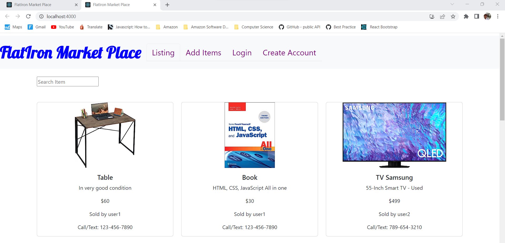

# Flatiron Market Place

Flatiron Market Place is an application for students of Flatiron school to buy and sell used items.

The project consists of two repositories:

1. [json-server repository](https://github.com/nnpk1007/json-server-react-app): This repository contains the code for the JSON Server, which serves as the backend for Flatiron Market Place app. It handles the storage and retrieval of listing items and users data.
2. [React app repository](https://github.com/nnpk1007/flatiron-market-place-react-app): This repository contains the code for the React frontend of Flatiron Market Place app. It provides the user interface for interacting with listing items.

## Custom Environment Variables
The React app uses custom environment variables to configure different settings based on the environment (development or production). The following files have been provided:

- env.development: Contains environment variables used for development.
- env.production: Contains environment variables used for production.

## Development
To work on Flatiron Market Place app locally, follow the steps below:

### Setting up the JSON Server
1. Fork and clone the [json-server repository](https://github.com/nnpk1007/json-server-react-app) to your local machine, and change directory into this folder
2. Install the required dependencies by running the following command : 
    <pre>
    npm install
    </pre>
3. Start the JSON Server by running the following command:
    <pre>
    json-server db.json
    </pre>
    This will start the JSON Server on the default port 3000

### Setting up the React App
1. Clone the [flatiron-market-place-react-app](https://github.com/nnpk1007/flatiron-market-place-react-app) repository to your local machine, and change directory into this folder
2. Install the required dependencies by running the following command in the repository's root directory:
    <pre>
    npm install
    </pre>
3. Start the React development server by running the following command:
    <pre>
    npm start
    </pre>
    This will start the React app in development mode and open it in your default browser. Any changes you make to the code will trigger an automatic reload.
4. You can access the Flatiron Market Place application by visiting [http://localhost:4000](http://localhost:4000) in your browser.

## Production
- The Flatiron Market Place app is already deployed and accessible using the following link: [https://flatiron-market-place.netlify.app/](https://flatiron-market-place.netlify.app/). You may wait a litte bit for the back-end server to be loaded on render.com.
- The json database is already deployed and accessible using the following link: [https://flatiron-market-place-json-server.onrender.com](https://flatiron-market-place-json-server.onrender.com)

### To use the deployed version, simply visit the provided [link](https://flatiron-market-place.netlify.app/) in your browser.

## Features
- View listing items.
- Create your account.
- Login to add items for sale.
- Remove item button is only showed when you're logged in and that item is added by you.
## Technologies and Images Used
- JSON Server: A simple JSON-based database to store listing items and users data.
- React: A JavaScript library for building user interfaces.
- React Router Ver 6 which is not cover in my curiculum. Learing source: [https://blog.logrocket.com/react-router-v6-guide/](https://blog.logrocket.com/react-router-v6-guide/)
- Higher-order component to create an authenticate requirement. Learning source:[https://www.makeuseof.com/create-protected-route-in-react/](https://www.makeuseof.com/create-protected-route-in-react/#:~:text=To%20protect%20routes%2C%20the%20private,private%20component%20as%20a%20child.&text=The%20Protected%20component%20will%20check%20whether%20isLoggedIn%20is%20true%20or%20false.)
- Render: A hosting platform for deploying database (back-end).
- Netlify: A hosting platform for deploying React applications (front-end).
- Bootstrap: A CSS framework for styling and layout.
- Random images on the internet which are used for study purpose only.

### Feel free to contribute to the project by submitting pull requests or opening issues in the respective repositories.